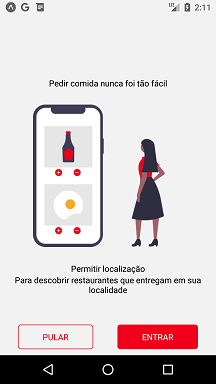

# DIO-iFood-Clone
Projeto desenvolvido no curso "Criando a Interface do iFood com React Native" da [Digital Innovation One](https://digitalinnovation.one).

Código base: https://github.com/pablohdev/app-ifood-clone/

## Instruções
Depois de obter o projeto no seu computador local, acesse o diretório raíz do projeto em uma janela de linha de comandos do sistema.

Instale as dependências do projeto:
```bash
yarn
```

Este projeto uso o [Expo](https://expo.io/). Para iniciar o projeto, faça o seguinte:
```bash
expo start
```

**Obs:** Para executar o aplicativo em um dispositivo real, leia o QR Code por meio do cliente Expo Go.

**Obs:** Para executar o aplicativo no emulador, use a tecla correspondente ao sistema operacional do dispositivo emulado.

## Principais bibliotecas e dependências de projeto
- React Native
- React Navigation
- Expo
- Styled Components

## Screenshots

